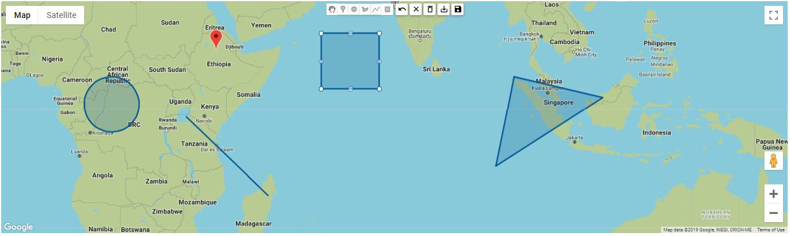

# Google Map Drawing Controls for Angular (NgxGoogleMapHelper)

[](https://travis-ci.org/imanshu15/ngx-google-map-helper) [](https://github.com/imanshu15/ngx-google-map-helper)

An angular package for using drawing control options of Google Map API. It provides following features,

  - Google Map API Drawing Controls (Marker, Rectangle, Polyline, Polygon, Circle)
  - Custom Buttons (Save, Undo, Delete...)
  - Output Events (OverlayCompleted, MapClicked..)

You can check it online through here [NGXGoogleMapHelper Demo](https://imanshu15.github.io/ngx-google-map-helper/)


### Installation

NgxGoogleMapHelper requires [Angular](https://angular.io/) v7+ to run.

Install using npm,
```sh
$ npm install ngx-google-map-helper --save
```

### Usage

##### Import

Add ```NgxGoogleMapHelperModule``` to your module file:

```javascript
imports: [
    ... , //your modules
    NgxGoogleMapHelperModule.forRoot({
      apiKey: 'XXXXXXXXXXXXXXXXXXXXXX'
    })
  ]
```

### Example

After importing ```NgxGoogleMapHelperModule``` in your module file just use the ```ngx-google-map-helper``` component as below,
```html

<ngx-google-map-helper 
    [locationAccess] = true 
    [showControl] = true 
    [mapHeight] = "'1000px'" 
    [mapWidth] = "'50%'"> </ngx-google-map-helper>
</form>

```

### Options

You can go through Google Map API here. [Google Map Javscript API](https://developers.google.com/maps/documentation/javascript/overlays)

| Option | Type | Description                     | Values | Default |
|--------------------|---------------|-------------------------------------------------------------------------------------|------------------------------------------------------------|---------------------------------------------------------------------------------------------------------------------------------------|
| mapHeight | string | Sets the height of the map | '100px','100%'... | '500px' |
| mapWidth | string | Sets the width of the map | '100px','100%'... | '100%' |
| zoom | int | Sets the zoom of map | any number | 10 |
| center | LatLang | Sets the center of map | object of LatLang | {lat: -34.397, lng: 150.644} |
| mapType | string | Sets the type of map | ['ROADMAP', 'SATELLITE',  'HYBRID', 'TERRAIN'] | 'ROADMAP' |
| showErrors | boolean | Shows custom error messages on console | true,false | true |
| locationAccess | boolean | Allow to get the location of the user | true,false | true |
| placeMarkerOnClick | boolean | Places a marker on map in every click | true,false | false |
| showControl | boolean | Shows google map drawing controls | true,false | true |
| position | string | Sets the location of drawing tools.Refer drawing tools positions of Google Map API. | 'TOP_CENTER' , 'TOP_RIGHT' , 'BOTTOM_LEFT',... | 'TOP_CENTER' |
| showModes | string[] | Shows only specified drawing controls. When null shows all. | 'marker' , 'circle' , 'polygon' , 'polyline' , 'rectangle' | All |
| commonOption | OverLayOption | Sets the properties of all drawing options. | object of OverLayOption | {fillColor:'#005696' ,fillOpacity:0.2, strokeColor:'#005696' ,strokeWeight:3, clickable:true, editable:true, draggable:true,zIndex:1} |
| circleOption | OverLayOption | Overrides only the circle overlay properties. | object of OverLayOption | same as common option default |
| polygonOption | OverLayOption | Overrides only the polygon overlay properties. | object of OverLayOption | same as common option default |
| polylineOption | OverLayOption | Overrides only the polyline overlay properties. | object of OverLayOption | same as common option default |
| rectangleOption | OverLayOption | Overrides only the rectangle overlay properties. | object of OverLayOption | same as common option default |
| markerOption | MarkerOption | Overrides only the marker properties. | object of MarkerOption | {animation: 'DROP',draggable: true,title: '',icon: null} |
| customButtons | boolean | Shows custom buttons - Undo,Save,Clear ... | true,false | true |
| onlyCustomButtons | string[] | Shows only the specified custom buttons.By default shows all. | 'undo','clear','delete', 'save','saveAll' | All |
| googleMapObjects | boolean | If true, returns google map objects rather than custom objects. | true,false | false |
| shapes | Shape[] | Pass overlays as a shape object to show the overlay on map | Shape objects | [] |

### Events

Please note that this events return shape objects only when ```googleMapObjects = true``` (by default true), if its false it will return google map event.

| Event | Description | Output |
|------------------|-----------------------------------------------------|------------------------|
| mapClicked | Event fires when user click on the map. | LatLng Object |
| overlayCompleted | Event fires as soon as overlay drawing is finished. | Shape Object |
| overlaySelected | Event fires when an overlay is selected | Shape Object |
| saveSeleted | Event fires when save custom button is clicked. | Shape Object |
| saveAll | Event fires when saveAll custom button is clicked. | Array of Shape Objects |

### Development

Want to contribute?
- Fork repository.
- Update ```./projects/ngx-google-map-helper```
- Build & Test the library.
- Update ```./src/app``` with new functionality.
- Update README.md accordingly.
- Pull request.

##### Instructions
- Download or clone the repository.
- Install dependencies ```$ npm install ```
- Start the app  ```$ npm start ```
- Build the app ```$ npm run build ``` or ```$ ng build ```
- Build the library after change run either ```$ npm run package ``` or ```$ ng build NgxGoogleMapHelper ``` 

verify app is working after ```$ npm start ```, 
```sh
http://localhost:4200
```


License
----
MIT
**Free Software**


 